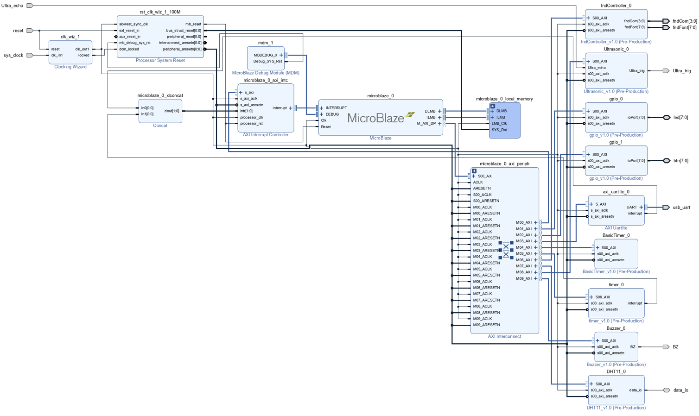
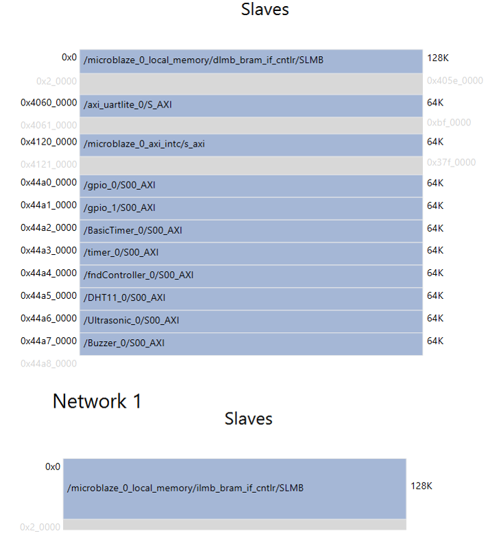
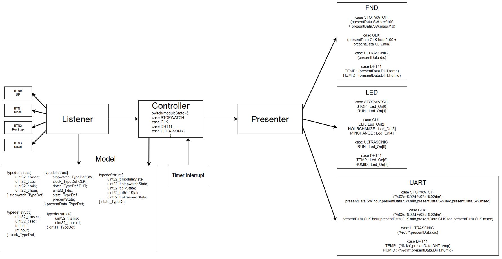
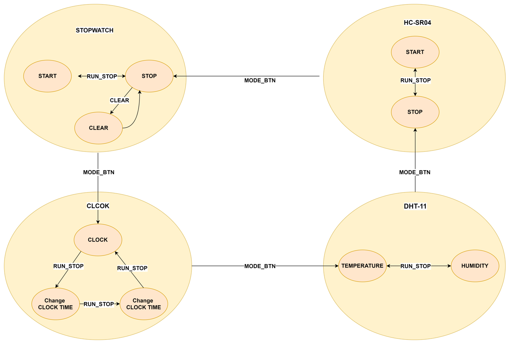

# AMBA AXI4-Based SoC Design

## Project Overview
This project aims to design hardware peripherals that can communicate with a MicroBlaze processor via the AMBA AXI4-Lite bus. The following functionalities were implemented:

- **Real-Time Clock & Stopwatch**
- **Temperature and Humidity Measurement using DHT11 Sensor**
- **Distance Measurement using HC-SR04 Ultrasonic Sensor**

The firmware was developed using **Vitis**, designed for efficient real-time data processing and control.

## System Block Diagram

## Hardware Architecture
### 1. AXI4-Lite
AMBA AXI4-Lite is a simplified version of the AXI4 protocol for low-bandwidth peripheral communication.

### 2. Timer
The timer is used to generate interrupts at specific intervals or to measure count values.

### 3. DHT11 (Temperature & Humidity Sensor)
- Extracts temperature and humidity values from a 40-bit data packet and verifies them.

### 4. HC-SR04 (Ultrasonic Sensor)
- Measures echo pulse width to calculate distance.

## Software Architecture
### IPO Modeling
The software design follows the IPO (Input-Process-Output) model.
- **Input (Listener)**: Collects external or user inputs.
- **Process (Controller)**: Handles data processing and logic application.
- **Output (Presenter)**: Formats and outputs the final data.
 

### FSM
 
